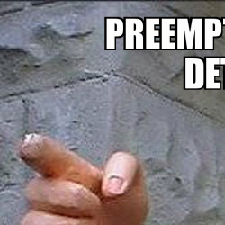

# imghide

`imghide` is a CLI utility to hide an image within another image.

## How it Works

It extracts the two most significant bits from the image to hide and places them in the two least significant bits of
the carrier image. The unstegged image will be grainier due to this transfer not being lossless.

## Examples

**Stegged**



**Unstegged**


## Usage

```
usage: imghide.py [-h] [-s STEG] [-i INPUT_FILE] -o OUTPUT_FILE [-u UNSTEG]

Hide image in another image

optional arguments:
  -h, --help            show this help message and exit
  -s STEG, --steg STEG  carrier image to steg
  -i INPUT_FILE, --input-file INPUT_FILE
                        image to hide
  -o OUTPUT_FILE, --output-file OUTPUT_FILE
                        output image
  -u UNSTEG, --unsteg UNSTEG
                        unsteg image
```

## License

None, steg some images and reuse the code at will.